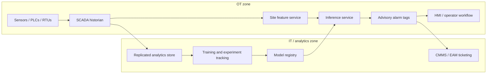

# Developing Deep Learning Models for SCADA-Based Equipment Fault Prediction

## Executive Summary

SCADA-based fault prediction is best treated as a family of related decision problems rather than a single modeling task. In practice, teams usually need some combination of online anomaly detection, fault-family classification, early-warning risk estimation over one or more horizons, and sometimes remaining-useful-life or survival-style estimates. Across recent SCADA reviews and anomaly-detection benchmarks, the recurring bottlenecks are label reliability, class imbalance, operating-regime shifts, time-aware validation, and false-alarm burden—not merely model novelty. That is why the strongest projects usually win on data design, leakage control, and alarm policy before they win on architecture choice. citeturn26view0turn26view5turn26view4turn31search18

If no high-quality labeled dataset already exists, the most robust starting point is a two-track program. Track A is a healthy-only or weakly supervised anomaly model, typically an autoencoder, forecasting model, or one-class method, trained to detect deviations from normal behavior. Track B is a supervised horizon-risk model trained only after maintenance logs, alarms, and component labels have been cleaned and aligned. This dual strategy is well matched to SCADA reality: assets spend most of their life in normal operation, exact fault onset is often uncertain, and minority fault classes are scarce. citeturn26view1turn27view9turn24search0turn26view5

For most teams, the most defensible first deep-learning stack is not a large Transformer. It is usually a strong preprocessing pipeline, a classical baseline suite, a GRU or TCN supervised sequence model, and a healthy-only autoencoder baseline. Transformers and graph neural networks become attractive when sequences are long, channel interactions are important, or the sensor graph is meaningful and stable. Deployment should usually begin in advisory mode, writing predictions back to the historian, HMI, or CMMS/EAM workflow rather than closing the loop directly into PLC logic. OT security and lifecycle governance should be designed in from day one, using established OT guidance and secure interoperability standards. citeturn6search22turn7search7turn7search0turn33view1turn33view2turn26view9

The central recommendation of this report is therefore simple: design the target and validation regime first, build a leak-free preprocessing and alerting pipeline second, and treat the model zoo as the third decision. That sequence is much more likely to produce an operationally useful system with stable lead time and tolerable false alarms. citeturn29search0turn31search18turn26view1turn27view7

## Problem Definition and Industrial Use Cases

A rigorous SCADA fault-prediction project should start by defining exactly what “prediction” means. The four most useful formulations are: present-state anomaly detection, fault-family diagnosis, horizon-based failure risk, and survival/RUL estimation. A horizon-risk label is often the most operationally useful formulation for SCADA because it asks a concrete question such as “Will component X fail within the next 7, 30, or 90 days?” and converts maintenance planning into a thresholding problem over model scores. RUL or survival formulations are attractive when event timing is well recorded and censored cases matter. Public prognostics datasets such as C-MAPSS and N-CMAPSS are especially useful for that last formulation, even though they are not SCADA systems in the OT historian sense. citeturn35view3turn32view4turn20search7

The industrial case for SCADA-based modeling is strongest where equipment is already heavily instrumented and the cost of downtime is high. OT guidance explicitly spans industrial control systems, building automation, transportation systems, physical-environment monitoring, and related programmable systems. Within the published SCADA literature, wind turbines dominate because they already produce structured multivariate telemetry, status codes, alarms, and maintenance records, and because public datasets are more available there than in most brownfield process industries. Water treatment and water distribution datasets are also widely used, although many of those benchmarks are security-attack datasets rather than true equipment-failure datasets. citeturn33view1turn26view0turn36search0turn36search5turn35view1

For equipment-fault prediction, the most useful industrial use cases are those in which early detection creates actionable maintenance lead time. Examples include wind-turbine gearbox, generator, bearing, pitch, and converter faults; pump, compressor, and fan degradation; HVAC and chiller health monitoring; and process-facility anomalies where a precursor shows up in temperature, power, pressure, vibration proxies, valve behavior, or alarm patterns before a maintenance event. A recent Transformer-based wind-turbine study, for example, combined SCADA operational data, alarms, and maintenance records to predict IGBT failures months ahead of failure, while recent normal-behavior-modeling work showed that healthy-only autoencoder pipelines can scale across multiple wind farms. citeturn24search0turn26view3turn26view1

A practical target design for a production program is often hierarchical. First, score “healthy vs suspicious.” Second, classify the suspicious windows into component or fault families when labels allow. Third, estimate risk across multiple lead-time horizons. This hierarchy maps well to real operations because it separates early warning from precise diagnosis, and it avoids forcing a brittle multi-class classifier when labels are incomplete or noisy. citeturn26view0turn24search0turn15search1

## SCADA Data, Labels, and Preprocessing

SCADA schemas mix several very different signal types that should not be treated the same way. In general, one sees continuous analog variables, digital state or mode tags, alarms and events, pulse or counter data, setpoints or commands, historian metadata, and maintenance context. In wind-turbine SCADA specifically, recent reviews group variables into environmental, electrical, control, and temperature categories. In many practical systems, change-of-state behavior and event-driven logging coexist with regularly sampled analog signals, which means naïve interpolation can create features that never existed physically. citeturn11search15turn11search0turn26view0turn11search2

Data-quality problems are usually the dominant source of model instability. Missing values often arise from sensor malfunctions or transmission issues; long SCADA histories also accumulate duplicates, time-zone mistakes, daylight-saving discontinuities, calibration shifts, stale sensors, maintenance-mode artifacts, startup and shutdown transients, curtailment or control-policy changes, and inconsistent aggregation between channels. High-frequency SCADA, when available, can materially improve prognosis for fast thermal or electrical failure modes compared with legacy 10-minute averages, but it also increases storage, synchronization, and drift-management burden. citeturn5search11turn22search4turn5search0turn5search4

Labeling should therefore be treated as a separate engineering product. The strongest labels come from joining SCADA historians with alarm histories, status codes, maintenance records, failure logbooks, and domain-expert fault-symptom analysis rather than trusting a single repair timestamp. Recent wind-farm studies illustrate the range: one uses SCADA operational plus alarm data together with maintenance records for supervised prediction; another uses structured failure-mode symptom analysis to define detectable precursors; and the CARE benchmark improves label quality with turbine-status-based point labels and detailed fault intervals. If exact onset is uncertain, keep three timestamps: last confirmed healthy state, first suspicious indication, and intervention/confirmation time. citeturn26view3turn15search1turn32view1

Rare-fault augmentation is useful, but only when it preserves operational physics. Reviews of imbalanced fault diagnosis consistently separate methods into data processing, model construction, and training optimization. In recent fault-diagnosis work, GAN-based balancing and CVAE-based augmentation both improved minority-class learning, and positive-unlabeled training has emerged as a sensible strategy when abundant unlabeled data coexist with a small set of confirmed fault windows. The caution is that synthetic windows can easily drift off the true operating manifold. In SCADA projects, I would only retain synthetic samples that pass regime-conditional plausibility checks and are not trivially separable from real minority samples by a simple discriminator. citeturn26view5turn8search5turn22search3turn27view9

A conservative end-to-end preprocessing sequence is shown below. This order follows the logic implicit in recent SCADA reviews and in production-style studies that emphasize normal-behavior baselines, data-quality filtering, and temporal post-processing. citeturn26view0turn26view1turn27view8

```mermaid
flowchart LR
    A[SCADA historian + alarms + maintenance records] --> B[Schema mapping by asset and tag type]
    B --> C[Time alignment and resampling]
    C --> D[Cleaning, range checks, mode filtering]
    D --> E[Imputation + missingness masks]
    E --> F[Normalization by train split and regime]
    F --> G[Feature engineering and residualization]
    G --> H[Windowing and multivariate sequence creation]
    H --> I{Learning setup}
    I --> J[Supervised classifier or risk model]
    I --> K[Healthy-only anomaly model]
    J --> L[Temporal smoothing, hysteresis, thresholding]
    K --> L
    L --> M[Alerts, lead time, CMMS feedback]
```



### Preprocessing comparison

| Step | Why it matters | Recommended default | Major pitfall if skipped | Evidence |
|---|---|---|---|---|
| Schema harmonization and resampling | Aligns heterogeneous analog, digital, event, and counter tags onto a common timeline | Resample analogs with mean/median; forward-fill state tags; convert counters to deltas or rates; never interpolate event logs as if they were continuous signals | Artificial trends, misordered states, impossible transitions | citeturn11search15turn11search0turn26view0 |
| Cleaning and mode filtering | Removes states that are operationally valid but irrelevant to fault learning | Filter startup, shutdown, test, maintenance, curtailment, and communication-failure modes unless they are explicit targets | Model learns operating mode instead of impending fault | citeturn26view0turn27view7turn27view8 |
| Imputation and missingness handling | Prevents models from confusing missing data with healthy or faulty behavior | Short gaps: interpolation/Kalman for continuous sensors, ffill for low-churn states; long gaps: keep a mask channel and consider learned imputation | Hidden leakage and spurious confidence | citeturn5search11turn22search4turn27view8 |
| Normalization | Stabilizes training under different magnitudes and regimes | Fit scalers on train only; use robust scaling or median/IQR; prefer per-regime or residual normalization if load dependence is strong | Leakage from train-test contamination; regime confounding | citeturn26view0turn26view1turn5search15 |
| Feature engineering | Encodes precursor structure that raw channels may hide | Add lags, first differences, rolling stats, ratios, residuals to normal-behavior models, alarm-count features, operating-mode indicators | Deep models waste capacity rediscovering obvious dynamics | citeturn26view1turn25search0turn24search0 |
| Windowing and multivariate sequence creation | Converts the historian into learnable fixed-shape examples | Build windows strictly within asset boundaries and between maintenance events; use windows of 32–512 steps with stride 1–8; concatenate missingness masks and context features | Massive leakage from overlapping windows crossing split boundaries | citeturn26view4turn31search18turn29search0 |

A strong default preprocessing policy for a first experiment is the following. Use one dataset row per asset per timestamp. Preserve the raw timestamp and asset ID. Resample to the slowest acceptable control interval for the use case. Split chronologically before any learned transform is fit. Compute robust train-only normalization. Create missing-value indicator channels. Build fixed windows with one label per window for each prediction horizon. Finally, ensure that no window crosses a maintenance intervention, a confirmed failure start, or a data blackout. This sounds mundane, but it is often where the real performance gains come from. citeturn26view0turn26view4turn31search18

## Model Architectures and Imbalance-Aware Training

Model choice should be driven by the structure of the SCADA problem rather than by current fashion. Recurrent models remain strong when sequences are moderate and labels are limited. Temporal convolutions are excellent when one wants parallel training, stable gradients, and long histories through dilation. Healthy-only autoencoders remain unusually strong baselines when labels are sparse. Transformers help when sequence length and variable interaction are central, but they demand more compute and often more careful regularization. Graph models help most when inter-sensor or inter-asset structure is meaningful and stable enough to learn or encode. citeturn6search22turn7search7turn7search0turn26view0turn27view2

### Model comparison

| Architecture | Best when | Main strengths | Main risks | Important knobs to tune | Evidence |
|---|---|---|---|---|---|
| LSTM | Medium-length windows, moderate label volume, clear temporal order | Mature and reliable for sequential dependence; often strong for lead-time classification and risk scoring | More parameters than GRU; slower than convolutions; can struggle with very long windows | hidden size 64–256, layers 1–3, dropout 0.1–0.5, bidirectional vs causal, window length | citeturn6search0turn24search0 |
| GRU | Same use cases as LSTM but with tighter latency or smaller datasets | Fewer gates and often faster than LSTM while remaining competitive | May underfit very complex long-range patterns relative to larger models | hidden size 64–256, layers 1–3, dropout 0.1–0.5, window length, residual skip | citeturn6search1turn37search2 |
| Transformer | Long windows, many correlated channels, need for attention across time and variables | Strong for long-range dependencies and multivariate interactions; natural path to patching and masking schemes | Compute-heavy; data-hungry; threshold stability can be tricky in production | d_model 64–512, heads 4–8, layers 2–6, FFN width, dropout, patch size, attention mask style | citeturn7search13turn7search7turn24search0 |
| CNN-LSTM | Local transient patterns matter before longer temporal reasoning | Convolutions extract short motifs and denoise inputs before recurrent memory | More tuning decisions and more brittle than plain GRU/TCN when data are limited | conv channels 16–128, kernel 3–9, pooling, LSTM hidden size, attention layer, receptive field | citeturn37search11turn37search5 |
| TCN | Need long context, stable training, and faster parallelization | Dilated convolutions give large receptive fields with simpler optimization than RNNs | Receptive field must be sized carefully; can miss variable-specific structure without channel tricks | channels 32–256, layers 4–10, kernel 2–8, dilation schedule, residual blocks, dropout | citeturn6search22turn6search2 |
| Autoencoder or VAE | Very scarce labels; healthy-only or semi-supervised detection | Excellent first anomaly baseline; easy to train on known-healthy data; reconstruction or forecast residuals are interpretable | Threshold selection and drift handling matter; can reconstruct anomalies too well if over-capacious | latent size 8–64, depth 2–4, denoising, recon vs forecast loss, thresholding policy, residual post-filtering | citeturn26view1turn15search1turn37search4 |
| Graph neural net or spatiotemporal GNN | Sensor topology or learned channel relations are important; fleets or subsystems have interpretable structure | Can learn cross-sensor dependencies and aid root-cause localization | Harder to deploy when topology changes; graph learning can overfit or become unstable | graph construction, top-k edges, hidden size 32–128, attention heads, temporal encoder, static vs learned graph | citeturn7search0turn7search8turn25search12 |

For a first serious research cycle, my ranking is usually: TCN or GRU as the first supervised deep baseline, autoencoder as the first healthy-only baseline, and Transformer or GNN as later candidates introduced only after the smaller models have been optimized and fairly compared. That ordering is consistent with what anomaly-detection benchmarks have taught the field: evaluation assumptions matter, and more complex models do not automatically win under industrial constraints. citeturn26view4turn31search18turn16search6

Training under class imbalance should be tailored to the label regime. When you have confirmed fault classes, use event-balanced or asset-balanced batching, weighted cross-entropy or focal loss, and threshold tuning on a chronological validation set. When you have very few confirmed anomalies but lots of unlabeled data, use positive-unlabeled or semi-supervised methods. When labels are very weak or delayed, add robust learning against label noise, including sample reweighting, co-training, or label-refurbishment strategies. If cross-site privacy blocks centralization, federated learning is promising, but it is still more operationally complex than central training and should be justified by governance requirements rather than novelty. citeturn26view5turn27view9turn23search0turn23search5

Synthetic augmentation deserves special care. Time warping, magnitude jitter, and window cropping are safe only if they preserve the physics and operating regime. For rare faults, recent work suggests that conditional generative methods such as GANs and CVAEs can help, but they should be treated as controlled experiments, not default infrastructure. My rule is to introduce synthetic augmentation only after a no-augmentation baseline exists, and to keep it only if it improves minority recall without increasing false alarms materially on the chronological holdout. citeturn8search5turn15search0turn26view5

Uncertainty is also worth budgeting for early. In maintenance settings, a calibrated “I am unsure” outcome can be more valuable than an overconfident false alarm. Practical ways to start are deep ensembles, Monte Carlo dropout, and conformal wrappers around horizon-risk models or anomaly scores. Recent prognostics work and time-series conformal research point in the same direction: uncertainty estimation improves downstream trust and is especially important under distribution shift or distorted production data. citeturn10search18turn10search10turn10search20

## Evaluation, Baselines, and Experimental Design

Evaluation for SCADA fault prediction should be chronological, event-aware, and cost-sensitive. Random train-test splits over overlapping windows are usually inappropriate because they leak near-identical temporal context from train into test. The minimum defensible validation stack is a chronological holdout plus rolling-origin cross-validation, ideally with an additional split by asset, site, or fleet to test transfer. Recent benchmarks in time-series anomaly detection were motivated precisely by the gap between common evaluation assumptions and real operational demands. citeturn26view4turn31search18

### Public datasets worth considering

| Dataset | Best use | What you actually get | Main limitation |
|---|---|---|---|
| CARE wind-turbine benchmark citeturn19search3turn32view1 | Early fault detection benchmarking directly on wind SCADA | 95 datasets, 89 years of SCADA time series, 36 turbines, 44 labeled anomaly intervals, 51 normal series, feature sets that vary by wind farm | Wind-specific; feature schema differs across farms |
| EDP open wind data citeturn26view8turn32view5 | Public reproducible prototyping, schema design, feature engineering | Public wind-turbine SCADA signals, met mast data, records, and failure history on an open data portal | Labels are less rich than proprietary CMMS-linked datasets |
| SWaT citeturn36search0turn36search16turn36search14 | Multivariate anomaly-detection methodology in ICS-like telemetry | High-fidelity six-stage water-treatment testbed with multivariate sensor and actuator data | Cyber-physical attack benchmark, not an equipment-fault benchmark |
| WADI citeturn36search5turn36search13 | Long-horizon anomaly detection and missing-data robustness | Large water-distribution ICS dataset with many sensors and actuators over normal and attack periods | Huge and messy; many NaNs; again not a maintenance-fault dataset |
| HAI citeturn35view1turn3search5 | Realistic ICS anomaly-detection research, graph methods, label-reliability studies | HIL-based ICS dataset covering boiler, turbine, and water-treatment processes across several dataset versions | Security/anomaly focus is stronger than maintenance-fault focus |
| C-MAPSS citeturn35view3 | RUL and horizon-risk modeling with strong baselines | Simulated run-to-failure turbofan trajectories under different conditions and fault modes | Not a SCADA/historian dataset; synthetic and simplified flight snapshots |
| N-CMAPSS citeturn32view4 | More realistic prognostics and risk modeling under varying conditions | Synthetic run-to-failure trajectories for 128 units and seven failure modes under real flight conditions | Still simulated; not a direct OT/SCADA dataset |
| PHM Society 2023 challenge citeturn35view2 | Confidence-aware severity prediction and OOD-style generalization | Healthy and fault-severity data over many operating conditions with confidence reporting | Domain-specific challenge data rather than general SCADA |

If the end goal is true equipment-fault prediction from SCADA, CARE and EDP are the most directly relevant public wind resources in this list. SWaT, WADI, and HAI are excellent for anomaly-detection methodology and event-level evaluation, but they are weaker proxies for maintenance events. C-MAPSS and N-CMAPSS are excellent for prognosis and lead-time modeling, but they should be treated as adjacent sequence-health datasets rather than SCADA datasets. citeturn32view1turn26view8turn36search0turn35view1turn32view4

Metrics should be reported at three levels. At the point or window level, use precision, recall, F1, ROC-AUC, PR-AUC, and calibration metrics such as Brier score or reliability diagrams for probabilistic outputs. At the event level, use range-aware or event-aware metrics such as TaPR and PATE, and report first-alert lead time, detection coverage, and the number of false alarm events rather than only false positive windows. In wind-turbine early-fault settings, the CARE score is also useful because it explicitly combines coverage, accuracy, reliability, and earliness. At the business level, report false alarms per asset-month, mean time between false alarms, median and percentile lead times, and an expected-cost metric that weights missed failures more heavily than nuisance alerts. citeturn31search2turn29search0turn29search2turn19search11turn31search15

Baseline models should be intentionally broad. I would include: a no-ML threshold baseline on expert rules; EWMA/CUSUM or change-point detection; PCA with Hotelling’s T²/Q residual charts; one-class SVM or Isolation Forest; logistic regression and gradient-boosted trees on handcrafted window aggregates; a survival baseline if RUL or hazard is in scope; a GRU or TCN supervised deep model; and a healthy-only autoencoder. The purpose of this baseline set is not ceremonial. It is to reveal where the gains truly come from: better labels, better features, longer receptive field, better post-processing, or simply more capacity. citeturn27view7turn26view4turn31search18turn16search3

Ablation should be treated as a first-class deliverable. At minimum, run ablations on feature sets, regime conditioning, missingness masks, normalization choice, window length, stride, label horizon, imbalance treatment, temporal smoothing, threshold selection, and whether augmentation or uncertainty calibration helps. Also compare pooled fleet models with per-asset fine-tuning, since that choice often dominates architecture. citeturn26view0turn26view1turn10search20

### Recommended experimental plan

| Phase | Typical duration | Main work | Compute need | Deliverables |
|---|---:|---|---|---|
| Data audit and task framing | 1–2 weeks | Tag inventory, data dictionary, missingness audit, target definition, failure taxonomy | 16 CPU cores, 64–128 GB RAM | Dataset card, label spec, leakage map |
| Label construction | 1–2 weeks | Join historian, alarms, status codes, work orders, failure reports; define horizons | CPU only | Gold/gray/unknown labels, event intervals |
| Classical and shallow baselines | 1–2 weeks | Rules, change-point, PCA, one-class, boosted trees | CPU or 1 small GPU | Baseline report, first false-alarm analysis |
| Deep sequence baselines | 2–3 weeks | GRU, TCN, autoencoder, CNN-LSTM on chronological splits | 1× A10/L40S/RTX 4090 class GPU | Model cards, tuned baselines |
| Advanced models | 2–3 weeks | Transformer, GNN, PU learning, augmentation, uncertainty | 1–2 GPUs; more RAM for long windows | Comparative architecture report |
| Ablation and calibration | 1–2 weeks | Thresholds, smoothing, uncertainty, event metrics, cost analysis | 1 GPU + CPU | Final leaderboard, threshold policy |
| Pilot deployment | 2–4 weeks | Packaging, ONNX/TFLite export if needed, shadow mode, OT integration | Edge CPU or site VM; optional GPU | Pilot service, alert dashboard, retraining triggers |

A realistic compute budget for a medium-scale project is modest by modern standards. Most ETL and classical baselines are CPU-bound. Supervised GRU/TCN and autoencoder experiments generally fit on a single modern 24–48 GB GPU unless windows or channel counts are extremely large. Transformers, graph models, and large hyperparameter sweeps increase cost quickly, which is another reason to defer them until the simpler baselines are well optimized. The real expensive resource is usually engineering time spent on labels, not GPU hours. citeturn26view4turn26view0

## Deployment, Security, and OT Integration

Edge-versus-cloud deployment should be chosen by latency, bandwidth, reliability, and governance rather than by ideology. Edge inference is preferable when response must be near-real-time, network links are unreliable, or raw process data should remain on site. Cloud or central IT deployment is preferable for fleet training, experiment tracking, cross-asset model comparison, and heavy batch feature computation. In many industrial settings, the best pattern is hybrid: site-local feature extraction and inference, centralized retraining and governance. Edge-cloud reviews consistently emphasize lower latency and lower network congestion as the key architectural reasons for this hybrid pattern. citeturn12search10turn12search14



Model packaging should assume that the first pilot will run somewhere inconvenient: an on-prem VM, an industrial PC, or a modest edge server. That makes exportability and compression important. ONNX provides a standard interchange format for model interoperability; ONNX Runtime provides static and dynamic quantization flows for 8-bit deployment; and TensorFlow Lite documents post-training quantization as a way to reduce model size, CPU latency, and power with limited accuracy loss. In practice, I would use float32/float16 during model development, then benchmark int8 export for the final edge candidate. citeturn12search3turn32view8turn32view7

Integration with existing OT systems should begin in advisory mode. OT security guidance stresses that these environments have unique performance, reliability, and safety requirements, and ISA/IEC 62443 frames security as a lifecycle responsibility shared across asset owners, integrators, suppliers, and service providers. For data integration, OPC UA is attractive because the standard explicitly supports platform independence, extensibility, information modeling, encryption, authentication, and auditing. In brownfield systems, a reasonable first step is therefore to read historian data and alarms through existing interfaces, publish model outputs as advisory tags or events, and connect those outputs to HMI dashboards and maintenance workflows before any automated control action is contemplated. citeturn33view1turn33view2turn26view9

Security and privacy should be handled as operational requirements, not late-stage paperwork. Site data may contain not only telemetry but also commercially sensitive process behavior and maintenance intelligence. Use network segmentation, least-privilege service accounts, signed model artifacts, reproducible feature definitions, and separate update paths for model code and control logic. If multi-site collaboration is needed but raw data cannot leave the plant, federated or site-local training can help, although it adds orchestration complexity. AI lifecycle guidance also recommends monitoring for data, model, and concept drift over time; in maintenance applications, that should trigger threshold review, recalibration, or retraining. citeturn33view0turn33view1turn23search5turn10search20turn14search2

For production monitoring, track at least seven things: inference latency, missing-tag rate, drift in key feature distributions, alert volume per asset-week, false alarms per asset-month, lead-time distribution, and calibration drift for probabilistic outputs. If uncertainty is part of the stack, track coverage and abstention as well. Retraining should not be purely periodic; it should also be event-driven when alarm burden, drift, or maintenance-policy changes invalidate the original operating assumptions. citeturn33view0turn10search10turn10search20

## Prioritized Reading List and Reusable Starting Assets

### Prioritized reading list

1. **Recent advances in wind turbine condition monitoring using SCADA data** — the most useful recent SCADA-specific review to read first if your system is physically similar to sensor-rich rotating equipment. citeturn18search0turn26view0  
2. **Deep learning for time series anomaly detection: a survey** — broad survey of deep anomaly-detection families, useful for framing healthy-only and weakly supervised methods. citeturn8search23  
3. **A Survey of Deep Anomaly Detection in Multivariate Time Series** — recent taxonomy-oriented review with useful references to Transformer, graph, autoencoder, and GAN families. citeturn2search3turn27view2  
4. **A Systematic Review on Imbalanced Learning Methods in Intelligent Fault Diagnosis** — the best conceptual starting point for loss weighting, resampling, augmentation, and training optimization under rare faults. citeturn8search4turn26view5  
5. **Scalable SCADA-driven failure prediction for offshore wind turbines using autoencoder-based NBM and fleet-median filtering** — strong reference for healthy-only modeling, fleet-scale deployment, and temporal post-filtering. citeturn15search5turn26view1  
6. **Wind turbine fault detection based on the transformer model using SCADA data** — useful primary paper for supervised SCADA prediction using operational data, alarms, and maintenance records. citeturn24search0turn26view3  
7. **Wind Turbine Fault Diagnosis with Imbalanced SCADA Data Using Generative Adversarial Networks** — useful if you want one concrete recent example of generative balancing for rare SCADA faults. citeturn15search0turn22search3  
8. **An integrated change-point detection framework for wind turbine monitoring and fault diagnosis using SCADA data** — strong non-deep benchmark reference and especially useful for alarm-state logic. citeturn17search14turn27view7  
9. **TimeEval benchmark / evaluation paper** — essential reading for understanding why time-series anomaly evaluation is harder than point-wise classification. citeturn31search18turn9search23  
10. **TimeSeriesBench** — useful for modern benchmark thinking, especially around industrial-grade evaluation settings and unseen series. citeturn16search4turn26view4  
11. **PATE: Proximity-Aware Time Series Anomaly Evaluation** — the clearest recent reference on early vs delayed detections and why event-aware metrics matter. citeturn29search0turn29search2  
12. **CARE dataset paper and Zenodo release** — very strong public benchmark for early fault detection on wind-turbine SCADA. citeturn19search3turn32view1  
13. **entity["company","EDP","energy company"] open wind data portal** — practical public SCADA source for end-to-end prototyping and reproducibility. citeturn26view8turn32view5  
14. **entity["organization","NASA","us space agency"] PCoE repository, C-MAPSS, and N-CMAPSS** — best official starting point for prognostics-style sequence modeling and survival/RUL experiments. citeturn35view3turn32view4  
15. **entity["organization","PHM Society","prognostics society"] data challenges** — valuable for confidence-aware evaluation under incomplete operating-condition coverage. citeturn19search10turn35view2  
16. **entity["organization","iTrust Centre for Research in Cyber Security","research lab"] SWaT, WADI, and HAI resources** — best official sources if you want to pressure-test anomaly methods on ICS-like multivariate telemetry. citeturn36search0turn36search5turn35view1  
17. **entity["organization","NIST","us standards agency"] SP 800-82 Rev. 3 and AI RMF 1.0** — core official guidance for OT safety, reliability, security, and AI lifecycle risk. citeturn33view1turn33view0  
18. **entity["organization","ISA","automation standards body"]/IEC 62443 and entity["organization","OPC Foundation","interoperability consortium"] OPC UA** — practical official standards resources for cybersecurity lifecycle and OT/IT interoperability. citeturn33view2turn26view9  

### Sample preprocessing code snippet

The following snippet implements the report’s practical defaults: per-asset processing, typed resampling rules, short-gap imputation, missingness flags, robust scaling fitted on the training period, and fixed-length sequence windows. Those choices are directly aligned with recent SCADA preprocessing practice and with the main failure modes identified in current SCADA reviews and anomaly-evaluation work. citeturn26view0turn26view1turn29search0

```python
from __future__ import annotations

from dataclasses import dataclass
from typing import Iterable, Sequence

import numpy as np
import pandas as pd
from sklearn.preprocessing import RobustScaler


@dataclass
class Schema:
    analog_cols: Sequence[str]
    state_cols: Sequence[str]
    counter_cols: Sequence[str]
    context_cols: Sequence[str]


def resample_scada_asset(
    df: pd.DataFrame,
    schema: Schema,
    freq: str = "10min",
) -> pd.DataFrame:
    """
    Resample one asset's SCADA records onto a common grid.

    Required columns:
        - timestamp: pandas-compatible datetime
        - asset_id
        - features listed in Schema
    """
    if df.empty:
        raise ValueError("Input DataFrame is empty")

    out = df.copy()
    out["timestamp"] = pd.to_datetime(out["timestamp"], utc=True)
    out = out.sort_values("timestamp").set_index("timestamp")

    pieces = []

    if schema.analog_cols:
        analog = out[list(schema.analog_cols)].resample(freq).mean()
        pieces.append(analog)

    if schema.state_cols:
        # State tags: use latest known state and carry forward
        states = out[list(schema.state_cols)].resample(freq).last().ffill()
        pieces.append(states)

    if schema.counter_cols:
        # Convert counters to increments/rates after resampling
        counters = out[list(schema.counter_cols)].resample(freq).last().diff()
        counters = counters.clip(lower=0)
        pieces.append(counters)

    if schema.context_cols:
        context = out[list(schema.context_cols)].resample(freq).last().ffill()
        pieces.append(context)

    merged = pd.concat(pieces, axis=1)

    # Missingness features before imputation
    for col in merged.columns:
        merged[f"{col}__missing"] = merged[col].isna().astype("int8")

    # Short-gap imputation:
    #  - analogs: interpolate small gaps
    #  - states/context: forward-fill
    #  - counters: fill zeros after diff()
    if schema.analog_cols:
        merged[list(schema.analog_cols)] = (
            merged[list(schema.analog_cols)]
            .interpolate(method="time", limit=3)
            .ffill(limit=3)
            .bfill(limit=1)
        )

    if schema.state_cols:
        merged[list(schema.state_cols)] = merged[list(schema.state_cols)].ffill().bfill()

    if schema.context_cols:
        merged[list(schema.context_cols)] = merged[list(schema.context_cols)].ffill().bfill()

    if schema.counter_cols:
        merged[list(schema.counter_cols)] = merged[list(schema.counter_cols)].fillna(0.0)

    merged["row_missing_frac"] = merged.isna().mean(axis=1)
    merged = merged.reset_index()
    return merged


def fit_train_scaler(train_df: pd.DataFrame, feature_cols: Sequence[str]) -> RobustScaler:
    scaler = RobustScaler()
    scaler.fit(train_df[list(feature_cols)])
    return scaler


def apply_scaler(
    df: pd.DataFrame,
    scaler: RobustScaler,
    feature_cols: Sequence[str],
) -> pd.DataFrame:
    out = df.copy()
    out.loc[:, feature_cols] = scaler.transform(out[list(feature_cols)])
    return out


def build_windows(
    df: pd.DataFrame,
    feature_cols: Sequence[str],
    label_col: str,
    window: int = 96,   # e.g. 96 x 10min = 16 hours
    stride: int = 4,
) -> tuple[np.ndarray, np.ndarray]:
    """
    Build fixed-length windows from one preprocessed asset dataframe.
    Assumes df is already sorted by timestamp and contains one asset only.
    """
    x = df[list(feature_cols)].to_numpy(dtype=np.float32)
    y = df[label_col].to_numpy()

    xs, ys = [], []
    for start in range(0, len(df) - window + 1, stride):
        end = start + window
        xs.append(x[start:end])
        ys.append(y[end - 1])  # end-of-window label
    return np.stack(xs), np.asarray(ys)
```

### Sample PyTorch model skeletons

A good research starter pack is one supervised sequence model and one healthy-only anomaly model. The following skeletons are intentionally minimal so they can be extended with horizon heads, class weights, uncertainty estimation, or export tooling later. citeturn6search1turn6search22turn26view1

```python
from __future__ import annotations

import torch
import torch.nn as nn


class GRUFaultPredictor(nn.Module):
    """
    Supervised sequence model for:
      - binary anomaly / fault risk
      - multi-horizon risk heads
      - multi-class fault diagnosis
    """
    def __init__(
        self,
        input_dim: int,
        hidden_dim: int = 128,
        num_layers: int = 2,
        dropout: float = 0.2,
        output_dim: int = 1,  # 1 for binary logits, >1 for multiclass
    ) -> None:
        super().__init__()
        self.encoder = nn.GRU(
            input_size=input_dim,
            hidden_size=hidden_dim,
            num_layers=num_layers,
            batch_first=True,
            dropout=dropout if num_layers > 1 else 0.0,
        )
        self.head = nn.Sequential(
            nn.LayerNorm(hidden_dim),
            nn.Linear(hidden_dim, hidden_dim),
            nn.GELU(),
            nn.Dropout(dropout),
            nn.Linear(hidden_dim, output_dim),
        )

    def forward(self, x: torch.Tensor) -> torch.Tensor:
        # x: [batch, time, features]
        out, _ = self.encoder(x)
        last = out[:, -1, :]   # end-of-window representation
        return self.head(last)


class LSTMAutoencoder(nn.Module):
    """
    Healthy-only anomaly detector.
    Train on windows believed to be healthy and score reconstruction error.
    """
    def __init__(
        self,
        input_dim: int,
        hidden_dim: int = 128,
        latent_dim: int = 32,
        num_layers: int = 1,
    ) -> None:
        super().__init__()
        self.encoder = nn.LSTM(
            input_size=input_dim,
            hidden_size=hidden_dim,
            num_layers=num_layers,
            batch_first=True,
        )
        self.to_latent = nn.Linear(hidden_dim, latent_dim)
        self.from_latent = nn.Linear(latent_dim, hidden_dim)
        self.decoder = nn.LSTM(
            input_size=hidden_dim,
            hidden_size=hidden_dim,
            num_layers=num_layers,
            batch_first=True,
        )
        self.out = nn.Linear(hidden_dim, input_dim)

    def forward(self, x: torch.Tensor) -> torch.Tensor:
        # Encode sequence
        enc_out, (h_n, _) = self.encoder(x)
        h_last = h_n[-1]                          # [batch, hidden_dim]
        z = self.to_latent(h_last)                # [batch, latent_dim]
        seed = self.from_latent(z).unsqueeze(1)   # [batch, 1, hidden_dim]

        # Repeat latent seed across time for simple decoding
        repeated = seed.repeat(1, x.size(1), 1)
        dec_out, _ = self.decoder(repeated)
        recon = self.out(dec_out)
        return recon

    @staticmethod
    def anomaly_score(x: torch.Tensor, recon: torch.Tensor) -> torch.Tensor:
        # Mean squared reconstruction error per window
        return ((x - recon) ** 2).mean(dim=(1, 2))
```

In training, the supervised model would normally use `BCEWithLogitsLoss(pos_weight=...)` or focal loss for binary risk labels, while the autoencoder would be trained only on windows that are confidently healthy. In evaluation, I strongly recommend reporting both raw model scores and post-processed alert events after hysteresis or debounce logic, because operators react to alerts, not to logits. citeturn26view5turn29search0turn27view7

### Suggested visualizations for results

The most informative result package usually includes six visuals.

- A timeline plot for individual fault cases, showing raw channels, anomaly or risk score, threshold crossings, alarms, and the actual intervention time.
- Precision-recall and ROC curves at the window level, plus event-aware curves or PATE/VUS-style summaries at the event level.
- A lead-time distribution plot by fault family, showing median, quartiles, and worst cases.
- A false-alarm dashboard normalized as alerts per asset-week or asset-month.
- A confusion matrix by fault family and severity on the chronological holdout.
- A feature-attribution or residual-contribution chart for the top alert cases, ideally linked to the same timestamps operators inspect in the historian.

If the system uses learned embeddings, add one latent-space view such as UMAP or t-SNE for healthy vs fault windows, but only as a diagnostic; it should never substitute for proper temporal validation or event-aware metrics.