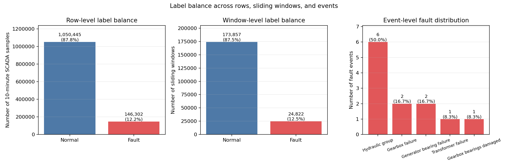
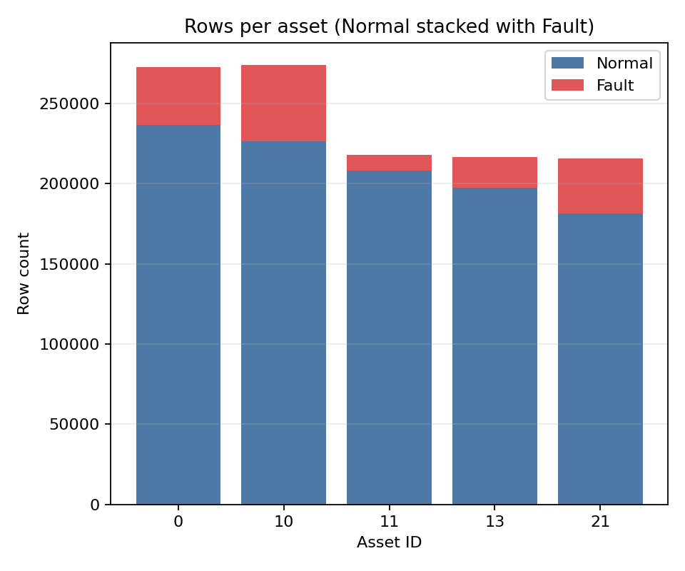
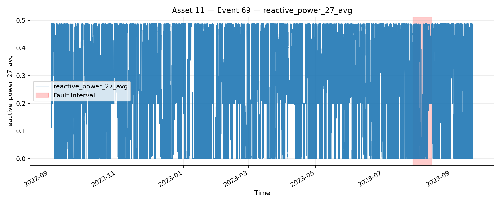
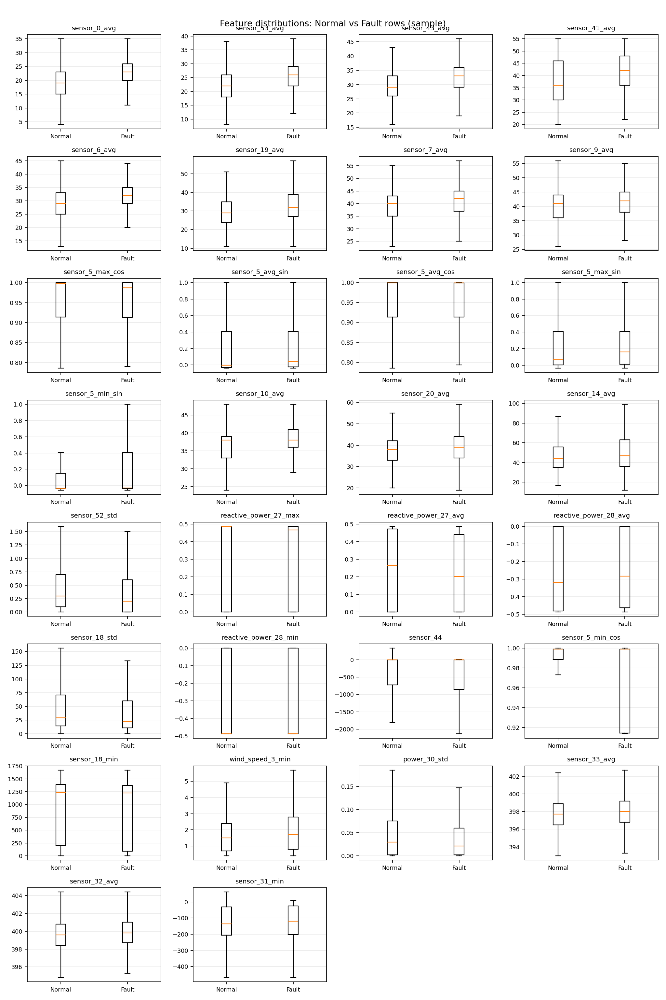
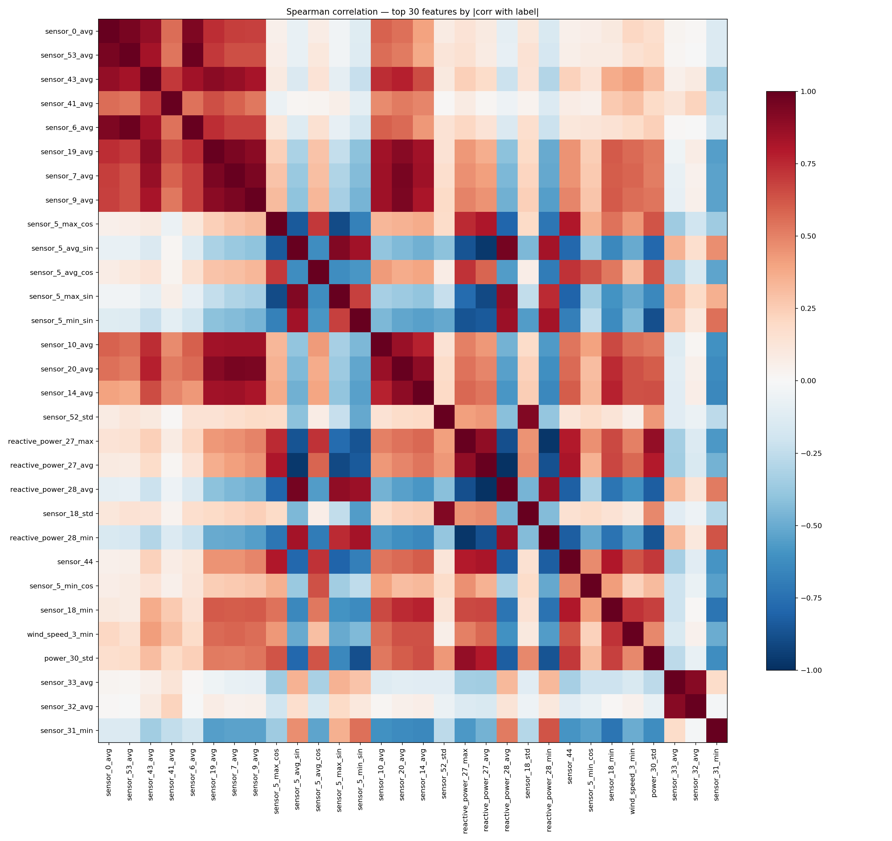
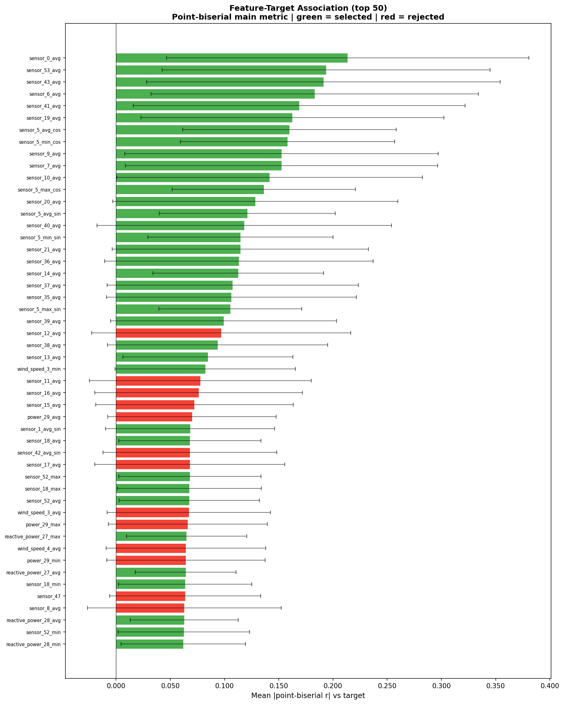
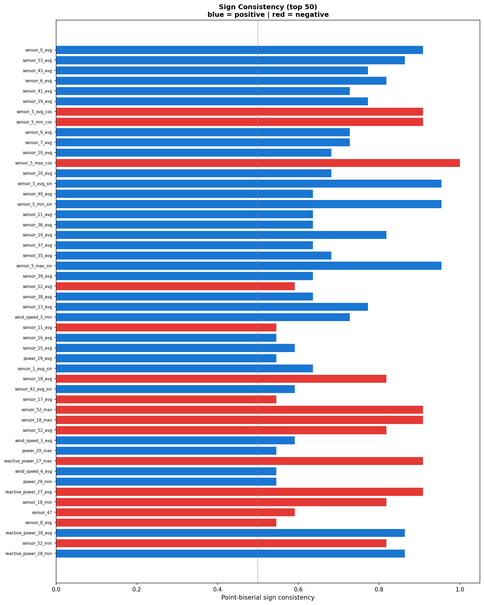
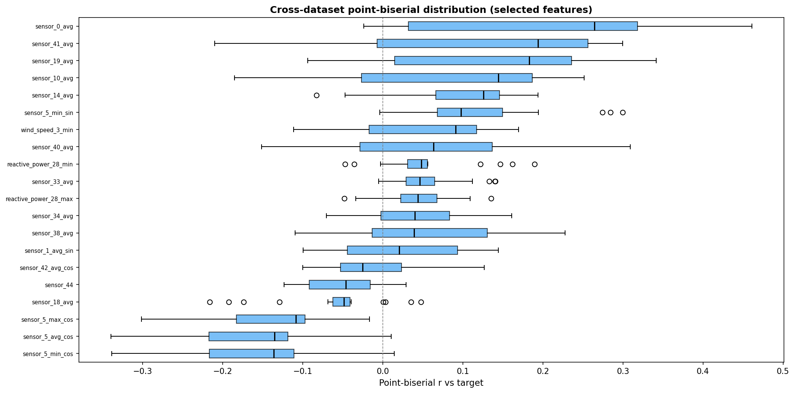
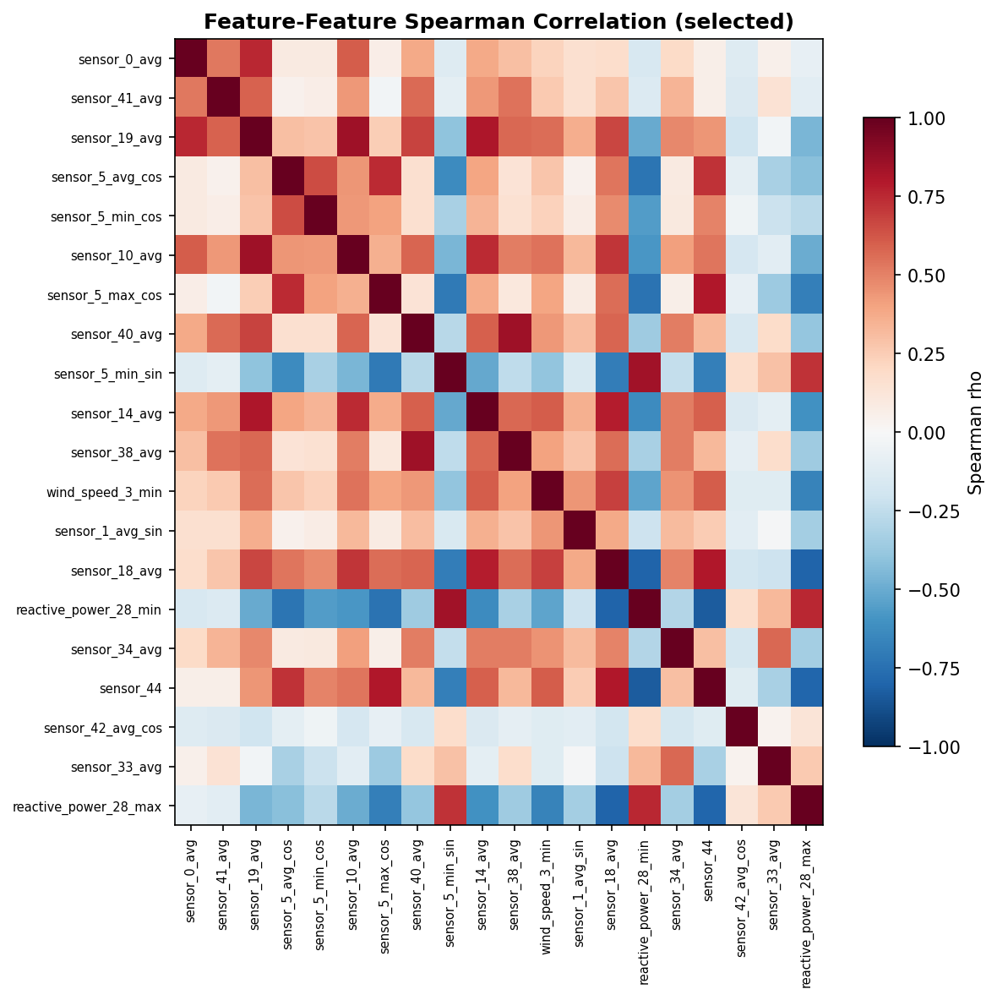

# EDA and Feature Screening Report for SCADA Fault Prediction

**Project:** SCADA Fault Prediction - CARE / Wind Farm A  
**Dataset artifact:** `Dataset/processed/combined_dataset.csv`  
**Primary modeling feature file:** `results/feature_screening_per_event/final_21_features.csv`  
**Date:** May 2026

---

## Abstract

This report separates two related but different stages in the project. The first stage is exploratory data analysis (EDA), whose purpose is to understand the combined SCADA dataset, inspect missingness, assess distribution shape, and identify visible feature-label and feature-feature correlation patterns. The second stage is feature screening / feature reduction, whose purpose is to construct a cleaner modeling feature set before sequence-window generation and model training.

The EDA-based screening run starts from 89 numeric candidate features and produces an exploratory 33-feature subset under `results/eda/combined_dataset/`. This is useful evidence for data understanding, but it should not be treated as the final modeling feature contract. The final modeling feature contract is produced by the per-event feature-screening pipeline in `src/data_pipeline/preprocessing/feature_screening.py`, with artifacts under `results/feature_screening_per_event/`. That pipeline applies event-wise feature-target screening, feature-feature Spearman redundancy removal, and then locks the current modeling feature file as `final_21_features.csv`.

This distinction is important for the capstone report:

```text
EDA = understand the dataset and generate exploratory evidence.
Feature screening = produce the clean feature set used by the model pipeline.
```

---

## 1. Dataset and Artifact Scope

The combined dataset contains 1,196,747 rows and 95 columns. Six columns are metadata or target columns:

```text
time_stamp, asset_id, sequence_id, train_test, status_type_id, label
```

After excluding metadata and the target label, the EDA stage identifies 89 numeric feature columns. The label is imbalanced: 146,302 rows are positive fault rows, corresponding to 12.225% of the combined dataset.

The report uses these project artifacts:

| Purpose | Artifact |
|---|---|
| EDA summary and plots | `results/eda/combined_dataset/` |
| EDA selected feature list | `results/eda/combined_dataset/eda_selected_features.csv` |
| EDA audit trail | `results/eda/combined_dataset/feature_selection_audit.csv` |
| Per-event feature screening metrics | `results/feature_screening_per_event/aggregated_feature_target_metrics.csv` |
| Per-event rejected features | `results/feature_screening_per_event/rejected_features.csv` |
| Feature-feature Spearman matrix | `results/feature_screening_per_event/feature_feature_corr.csv` |
| Automatic final screening output | `results/feature_screening_per_event/final_selected_features.csv` |
| Current modeling feature contract | `results/feature_screening_per_event/final_21_features.csv` |

### 1.1 Recommended Figure and Table Layout

For the capstone report, use the visual material in this order so the reader sees the logic before the final feature list:

| Report position | Recommended item | Source artifact | Purpose |
|---|---|---|---|
| Dataset description | Table 1. Dataset summary | `eda_summary.json` | Show dataset size, feature count, assets, and class imbalance |
| Dataset description | Figure 1. Label balance | `label_balance.png` | Make the imbalance visible |
| Dataset description | Figure 2. Per-asset row distribution | `per_asset_summary.png` | Show that data comes from multiple turbines |
| EDA section | Figure 3. Time-series overview | `time_series_overview.png` | Show temporal structure before feature reduction |
| EDA section | Figure 4. Feature distributions | `feature_distributions.png` | Show non-normal / skewed SCADA distributions |
| EDA section | Figure 5. EDA feature-feature correlation heatmap | `correlation_matrix.png` | Motivate redundancy removal |
| EDA result | Table 2. EDA reduction summary | `feature_selection_audit.csv` | Show 89 -> 33 exploratory features |
| Feature screening section | Table 3. Per-event screening summary | `selected_features.csv`, `rejected_features.csv`, `redundant_removed.csv` | Show 48 selected candidates, 39 rejected, 28 redundant removed |
| Feature screening section | Figures 6-8. Feature-target screening plots | `bar_mean_abs_pb_r.png`, `bar_pb_sign_consistency.png`, `boxplot_cross_dataset_pb_r.png` | Show which features are stable across events |
| Feature reduction section | Figure 9. Feature-feature Spearman heatmap | `heatmap_ff_corr.png` | Justify final redundancy reduction |
| Final feature contract | Table 4. Final 21 features | `final_21_features.csv` | Present the modeling feature list cleanly |

Table 1. Dataset summary.

| Metric | Value |
|---|---:|
| Total rows | 1,196,747 |
| Total columns | 95 |
| Metadata / target columns | 6 |
| Numeric candidate features | 89 |
| Assets | 5 |
| Positive fault rows | 146,302 |
| Positive fault ratio | 12.225% |



*Figure 1. The positive class is much smaller than the normal class, so model evaluation should not rely on accuracy alone.*



*Figure 2. The per-asset summary confirms that the combined dataset pools multiple turbines rather than a single operating unit.*

---

## 2. Scientific Basis

Feature selection is commonly used to reduce irrelevant, noisy, or redundant variables before model training. Guyon and Elisseeff describe feature selection as serving three practical goals: improving prediction, reducing computational cost, and improving understanding of the data-generating process [1]. This project follows that practical filter-method view: the screening stage is not a claim that the selected features are globally optimal; it is a transparent preprocessing filter before model training.

Filter methods are suitable here because they are model-agnostic and cheaper than wrapper methods. Wrapper approaches can search feature subsets using a specific learner, but they are computationally expensive and tied to the chosen model family [2]. Since this project compares several sequence models, a simple filter-based reduction is more appropriate than a model-specific feature selector.

The redundancy step follows the same motivation as the minimum-redundancy maximum-relevance principle. Peng, Long, and Ding proposed mRMR to balance feature relevance with low redundancy [3]. In this project, relevance is approximated using point-biserial / Spearman association with the binary label, and redundancy is approximated using pairwise feature-feature Spearman correlation.

Point-biserial correlation is used because the target is binary and the features are continuous numeric variables. Tate introduced point-biserial correlation as a correlation measure between a discrete binary variable and a continuous variable [4]. Spearman correlation is also reported because SCADA features are non-Gaussian and often monotonic but not linear. Spearman's rank correlation is a rank-based non-parametric association measure [5].

Missing values and constant features are treated as data-quality problems. Missing-data handling is a major source of bias if not controlled [6]. In this project, the combined EDA run found no missing feature values, while the screening code still handles missing pairs during correlation computation.

---

## 3. Stage A: Exploratory Data Analysis and EDA-Based Screening

### 3.1 Purpose

The EDA stage is implemented in:

```text
src/data_pipeline/eda.py
```

Its purpose is to inspect the combined SCADA CSV and produce descriptive evidence:

- missing-value tables
- feature statistics
- skewness and kurtosis
- Kolmogorov-Smirnov normality checks
- Spearman correlation with the binary label
- feature-feature Spearman heatmaps
- normal vs fault distribution plots
- per-asset summaries
- label balance plots

This is an exploratory data-understanding stage. It should be reported in the capstone methodology as EDA, not as the final modeling feature contract.

### 3.2 EDA-Based Screening Rule

When `src/data_pipeline/eda.py` is run with `--select-features`, it applies this rule set:

```text
1. Drop constant features where std == 0.
2. Drop features where missing_pct > max_missing_pct.
3. Drop features where abs(Spearman with label) < min_corr.
4. Remove redundant feature pairs where abs(feature-feature Spearman) > redundancy_threshold.
5. For redundant pairs, keep the feature with stronger absolute label correlation.
```

The observed EDA run used these defaults:

```text
min_corr = 0.02
max_missing_pct = 80.0
redundancy_threshold = 0.90
```

### 3.3 EDA Result

The EDA run started from 89 numeric candidate features and produced 33 selected exploratory features:

```text
results/eda/combined_dataset/eda_selected_features.csv
```

The audit file contains all 89 feature decisions:

```text
results/eda/combined_dataset/feature_selection_audit.csv
```

Table 2. EDA-based feature reduction summary.

| EDA filtering step | Features removed | Features remaining |
|---|---:|---:|
| Initial numeric candidate set | - | 89 |
| Constant feature removal | 2 | 87 |
| Missing-value filtering | 0 | 87 |
| Low Spearman-with-label filtering | 18 | 69 |
| Feature-feature redundancy removal | 36 | 33 |
| Final EDA exploratory subset | - | 33 |



*Figure 3. The time-series overview should be placed before detailed correlation plots because it shows the temporal nature of the SCADA observations.*



*Figure 4. The feature-distribution plot supports the use of rank-based Spearman correlation because SCADA variables are not normally distributed.*



*Figure 5. The EDA correlation heatmap visually motivates redundancy removal by showing highly correlated feature groups.*

This 33-feature subset is useful for EDA discussion because it shows which variables appear weak, constant, or redundant in the full combined table. However, it should not be described as the final feature set used by the current model pipeline.

### 3.4 Interpretation

The EDA result supports these statements:

- the dataset has 89 numeric feature candidates after metadata removal;
- the label is imbalanced, with about 12.225% positive rows;
- several thermal, angle, and reactive-power features show visible association with the fault label;
- many sensor groups are strongly redundant under Spearman correlation;
- a 33-feature exploratory subset can be produced using simple EDA thresholds.

For the capstone report, this belongs in a section such as:

```text
Exploratory Data Analysis
```

or:

```text
EDA-Based Feature Analysis
```

---

## 4. Stage B: Per-Event Feature Screening and Feature Reduction

### 4.1 Purpose

The modeling-oriented feature-screening stage is implemented in:

```text
src/data_pipeline/preprocessing/feature_screening.py
src/training/scripts/run_feature_screening.py
```

This stage is different from the EDA stage. It is designed to create a clean feature subset for downstream model preparation and sequence-window export. It operates across per-event CSVs, aggregates feature-target metrics across events, and then removes feature-feature redundancy.

### 4.2 Screening Rule in the Current Code

The current `FeatureScreening` pipeline applies these steps:

```text
1. Load each event CSV.
2. Drop metadata columns:
   time_stamp, asset_id, train_test, status_type_id, sequence_id, id.
3. Drop constant numeric features within each loaded dataset.
4. Compute feature-vs-label metrics:
   - point-biserial r
   - Spearman rho
   - p-values and significance flags
5. Aggregate feature-target metrics across valid event files.
6. Select candidates using point-biserial thresholds:
   - mean_abs_pb_r >= 0.05
   - pb_sign_consistency >= 0.60
   - pb_significant_ratio >= 0.30
7. Build feature-feature Spearman correlation on selected candidates.
8. Remove redundant features where abs(feature-feature Spearman) >= 0.85.
9. For redundant pairs, keep the feature with the stronger aggregated target score.
```

The feature-feature correlation step samples at most 10,000 normal rows per file while retaining anomaly rows, which keeps the redundancy calculation computationally manageable.

### 4.3 Current Per-Event Screening Artifacts

The existing per-event screening run produced these counts:

| Artifact | Count |
|---|---:|
| Candidate features selected before redundancy removal | 48 |
| Rejected features before redundancy removal | 39 |
| Redundant features removed | 28 |
| Automatic final output in `final_selected_features.csv` | 20 |
| Current locked modeling feature file in `final_21_features.csv` | 21 |



*Figure 6. This plot ranks features by average feature-target signal across events, using point-biserial correlation as the main score.*



*Figure 7. Sign consistency is important because a feature is less reliable if its relationship with the label changes direction across events.*



*Figure 8. The boxplot shows whether feature-target association is stable or dominated by only one event.*



*Figure 9. This heatmap is the main visual evidence for the redundancy-removal stage before locking the final feature file.*

The automatic output is:

```text
results/feature_screening_per_event/final_selected_features.csv
```

The current model-training feature contract is:

```text
results/feature_screening_per_event/final_21_features.csv
```

The count is not chosen because of a "top 20", "top 21", or "top 30" rule. It is the result of threshold-based screening and redundancy removal, followed by the project's current locked feature list for sequence training. In other words:

```text
21 is an artifact contract, not a top-k hyperparameter.
```

### 4.4 Current 21-Feature Modeling Contract

The current `final_21_features.csv` contains:

```text
sensor_0_avg
sensor_5_avg_sin
sensor_5_avg_cos
sensor_5_min_sin
sensor_5_min_cos
sensor_5_max_cos
sensor_1_avg_sin
sensor_10_avg
sensor_14_avg
sensor_18_avg
sensor_19_avg
sensor_33_avg
sensor_34_avg
sensor_38_avg
sensor_40_avg
sensor_41_avg
sensor_42_avg_cos
sensor_44
reactive_power_28_min
reactive_power_28_max
wind_speed_3_min
```

Table 4. Final 21-feature modeling contract, formatted for the capstone report.

| Group | Features |
|---|---|
| Sensor averages | `sensor_0_avg`, `sensor_10_avg`, `sensor_14_avg`, `sensor_18_avg`, `sensor_19_avg`, `sensor_33_avg`, `sensor_34_avg`, `sensor_38_avg`, `sensor_40_avg`, `sensor_41_avg`, `sensor_44` |
| Angle encodings | `sensor_5_avg_sin`, `sensor_5_avg_cos`, `sensor_5_min_sin`, `sensor_5_min_cos`, `sensor_5_max_cos`, `sensor_1_avg_sin`, `sensor_42_avg_cos` |
| Reactive power | `reactive_power_28_min`, `reactive_power_28_max` |
| Wind speed | `wind_speed_3_min` |

This is the feature file referenced by the current classifier preparation/reporting path:

```text
python src/main.py prepare ^
  --csv Dataset/processed/combined_dataset.csv ^
  --feature-file results/feature_screening_per_event/final_21_features.csv ^
  --window-hours 24
```

### 4.5 Interpretation

This feature-screening stage should be described as:

```text
heuristic feature screening for clean feature subset construction
```

or:

```text
modeling-oriented feature reduction
```

It should not be described as proof that these are the globally best features. The final model results still provide the real evidence that the selected feature set is adequate for the prediction task.

---

## 5. Difference Between the Two Stages

The two stages should both appear in the capstone report, but they should not be merged into one explanation.

| Aspect | EDA-based screening | Per-event feature screening |
|---|---|---|
| Main purpose | Understand the dataset | Build the modeling feature list |
| Main code | `src/data_pipeline/eda.py` | `src/data_pipeline/preprocessing/feature_screening.py` |
| Main input | Combined CSV | Per-event CSVs or split combined CSV |
| Main target metric | Spearman with label | Point-biserial as main metric, Spearman as robustness metric |
| Redundancy metric | Feature-feature Spearman | Feature-feature Spearman |
| Default redundancy threshold | 0.90 | 0.85 |
| Output feature count | 33 exploratory features | 21 current modeling features |
| Main artifact | `eda_selected_features.csv` | `final_21_features.csv` |
| How to report | EDA evidence | Final clean feature subset for training |

Recommended capstone structure:

```text
3.x Exploratory Data Analysis
3.x Feature Screening and Feature Reduction
```

The EDA section should discuss the 89-feature profile, label imbalance, missingness, non-normal distributions, feature-label correlations, and feature-feature heatmaps.

The feature-screening section should discuss the per-event aggregation, point-biserial / Spearman screening, feature-feature Spearman redundancy removal, and the final 21-feature modeling contract.

---

## 6. Limitations

This screening design is intentionally simple and transparent. It has several limitations:

1. Feature-target correlations are not causal evidence. A feature may correlate with fault rows because it changes after a fault has already developed.
2. Point-biserial and Spearman are univariate measures. They do not capture feature interactions.
3. Feature-feature Spearman removes redundant monotonic relationships, but it cannot prove that one feature is physically unnecessary.
4. The current per-event screening pipeline does not automatically mean "train-only" unless the input files or upstream split enforce that scope.
5. The 21-feature file is a modeling contract for the current pipeline, not a universal optimal feature count.

For these reasons, the report should use careful wording:

```text
The project applies heuristic feature screening to remove unusable, weakly informative, and redundant features before model training.
```

Avoid wording such as:

```text
The selected 21 features are proven to be the best features.
```

---

## 7. Conclusion

The project contains two valid but distinct feature-analysis stages. The EDA stage produces exploratory evidence and a 33-feature EDA subset under `results/eda/combined_dataset/`. The modeling-oriented feature-screening stage produces the current clean feature contract under `results/feature_screening_per_event/`, with `final_21_features.csv` used by the downstream sequence pipeline.

For the capstone project, both stages should be included:

- EDA explains what the dataset looks like and why feature reduction is reasonable.
- Feature screening explains how the final modeling feature list is constructed.

The final wording should emphasize that the selected feature set is a clean, reproducible preprocessing choice. The downstream model evaluation remains the main evidence for predictive performance.

---

## References

[1] I. Guyon and A. Elisseeff, "An Introduction to Variable and Feature Selection," *Journal of Machine Learning Research*, vol. 3, pp. 1157-1182, 2003. Available: https://jmlr.org/papers/v3/guyon03a.html

[2] R. Kohavi and G. H. John, "Wrappers for Feature Subset Selection," *Artificial Intelligence*, vol. 97, no. 1-2, pp. 273-324, 1997. doi: https://doi.org/10.1016/S0004-3702(97)00043-X

[3] H. Peng, F. Long, and C. Ding, "Feature Selection Based on Mutual Information: Criteria of Max-Dependency, Max-Relevance, and Min-Redundancy," *IEEE Transactions on Pattern Analysis and Machine Intelligence*, vol. 27, no. 8, pp. 1226-1238, 2005. doi: https://doi.org/10.1109/TPAMI.2005.159

[4] R. F. Tate, "Correlation Between a Discrete and a Continuous Variable. Point-Biserial Correlation," *The Annals of Mathematical Statistics*, vol. 25, no. 3, pp. 603-607, 1954. doi: https://doi.org/10.1214/aoms/1177728730

[5] C. Spearman, "The Proof and Measurement of Association Between Two Things," *The American Journal of Psychology*, vol. 15, no. 1, pp. 72-101, 1904. doi: https://doi.org/10.2307/1412159

[6] R. J. A. Little and D. B. Rubin, *Statistical Analysis with Missing Data*, 3rd ed. Wiley, 2019. Available: https://www.wiley.com/en-us/Statistical+Analysis+with+Missing+Data%2C+3rd+Edition-p-9780470526798
